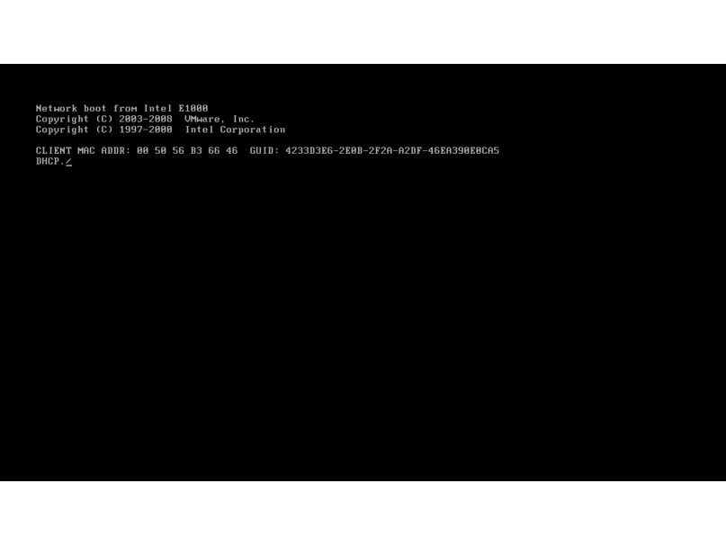

# docker-pxe

### Setup and Configurations
1. Go to pxe folder - cd pxe 
2. Modify pxe_api.go line 14 and specify your own kickstart file.
3. Compile the code - go build pxe_api.go

#### Note: Why settle for static kickstart files, when you could generate them :). Please check my [Kickstart File Generator](https://github.com/ppetko/kickstart-generator)

### Build docker image
```
sudo docker build -t docker-pxe -f Dockerfile .
Successfully built 5ae7591ee676
```
### Docker run
```
sudo docker run --rm --net=host --name docker-pxe -td -p 9090:9090 -p 67:67 -p 67:67/udp -p 69:69/udp docker-pxe
34cbe50dde1e305fb509e5e6a3f7d70a9b8662abe871f04583e847c46bd99909
```
### Verify the setup 
```
$curl your_container:9090/status
API is up and running
```

### Configure host for PXE boot 
```
curl http://${your_container}:9090/pxe/${hostname}/${uuid}
or 
curl http://${your_container}:9090/pxe/${hostname}/${mac_address}
```

<p align="center">

</p>

### API Endpoints
```
/status
/pxe/${hostname}/${uuid}
```
